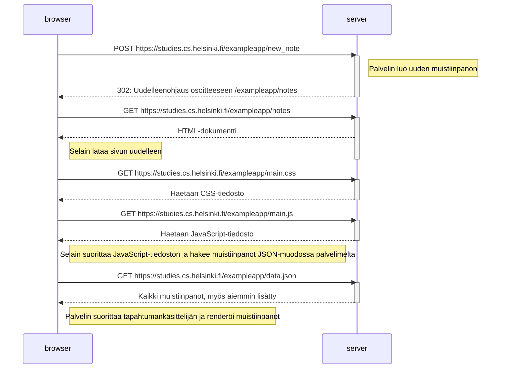

# Tehtävä 0.4: uusi muistiinpano

Sekvenssikaavio uuden muistiinpanon lisäämisestä kurssin esimerkkisovellukseen:

```mermaid
sequenceDiagram
    participant browser
    participant server
    
    browser->>server: POST https://studies.cs.helsinki.fi/exampleapp/new_note
    activate server
    Note right of server: Palvelin luo uuden muistiinpanon
    server-->>browser: 302: Uudelleenohjaus osoitteeseen /exampleapp/notes
    deactivate server

    browser->>server: GET https://studies.cs.helsinki.fi/exampleapp/notes
    activate server
    server-->>browser: HTML-dokumentti
    Note right of browser: Selain lataa sivun uudelleen
    deactivate server
    
    browser->>server: GET https://studies.cs.helsinki.fi/exampleapp/main.css
    activate server
    server-->>browser: Haetaan CSS-tiedosto
    deactivate server
    
    browser->>server: GET https://studies.cs.helsinki.fi/exampleapp/main.js
    activate server
    server-->>browser: Haetaan JavaScript-tiedosto
    deactivate server
    
    Note right of browser: Selain suorittaa JavaScript-tiedoston ja hakee muistiinpanot JSON-muodossa palvelimelta
    
    browser->>server: GET https://studies.cs.helsinki.fi/exampleapp/data.json
    activate server
    server-->>browser: Kaikki muistiinpanot, myös aiemmin lisätty
    deactivate server    

    Note right of browser: Palvelin suorittaa tapahtumankäsittelijän ja renderöi muistiinpanot
```
