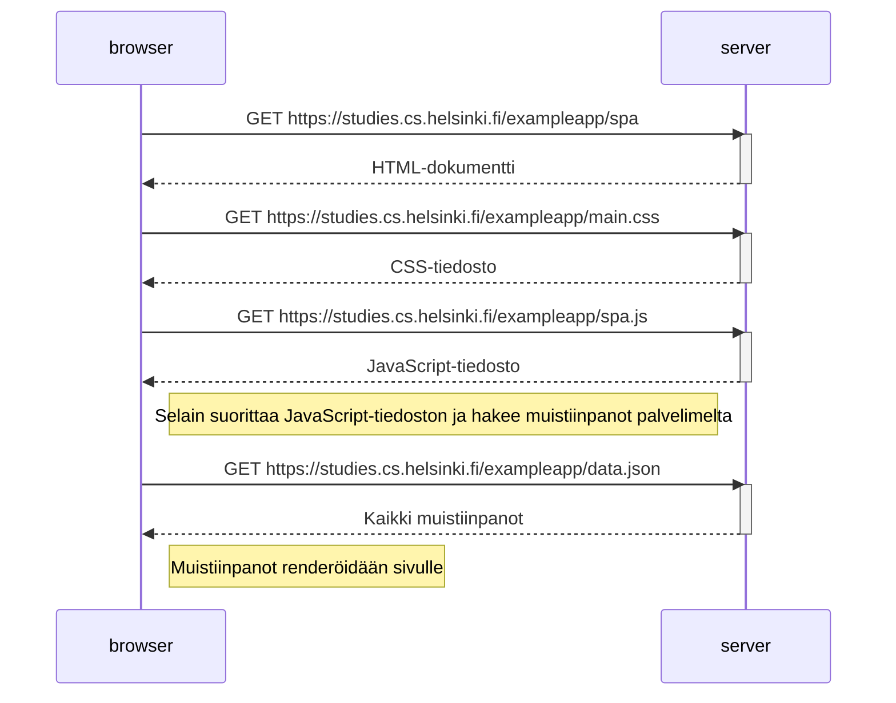

# Tehtävä 0.5: Single Page App

Sekvenssikaavio esimerkkisovelluksen SPA-version avaamisesta:

```mermaid
sequenceDiagram
    participant browser
    participant server
    
    browser->>server: GET https://studies.cs.helsinki.fi/exampleapp/spa
    activate server
    server-->>browser: HTML-dokumentti
    deactivate server
    
    browser->>server: GET https://studies.cs.helsinki.fi/exampleapp/main.css
    activate server
    server-->>browser: CSS-tiedosto
    deactivate server
    
    browser->>server: GET https://studies.cs.helsinki.fi/exampleapp/spa.js
    activate server
    server-->>browser: JavaScript-tiedosto
    deactivate server
    
    Note right of browser: Selain suorittaa JavaScript-tiedoston ja hakee muistiinpanot palvelimelta
    
    browser->>server: GET https://studies.cs.helsinki.fi/exampleapp/data.json
    activate server
    server-->>browser: Kaikki muistiinpanot
    deactivate server    

    Note right of browser: Muistiinpanot renderöidään sivulle
```
