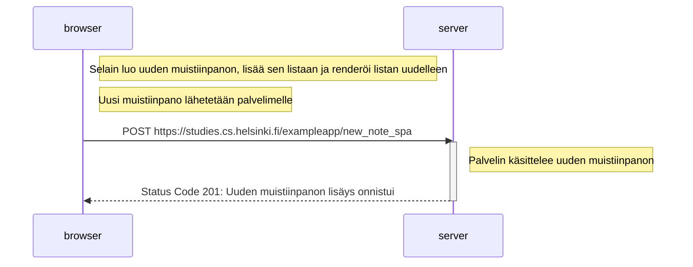

# Tehtävä 0.6: Uusi muistiinpano

Sekvenssikaavio uuden muistiinpanon lisäämisestä esimerkkisovelluksen SPA-versiossa:

```mermaid
sequenceDiagram
    participant browser
    participant server

    Note right of browser: Selain luo uuden muistiinpanon, lisää sen listaan ja renderöi listan uudelleen
    Note right of browser: Uusi muistiinpano lähetetään palvelimelle
    browser->>server: POST https://studies.cs.helsinki.fi/exampleapp/new_note_spa
    activate server
    Note right of server: Palvelin käsittelee uuden muistiinpanon
    server-->>browser: Status Code 201: Uuden muistiinpanon lisäys onnistui
    deactivate server
```
